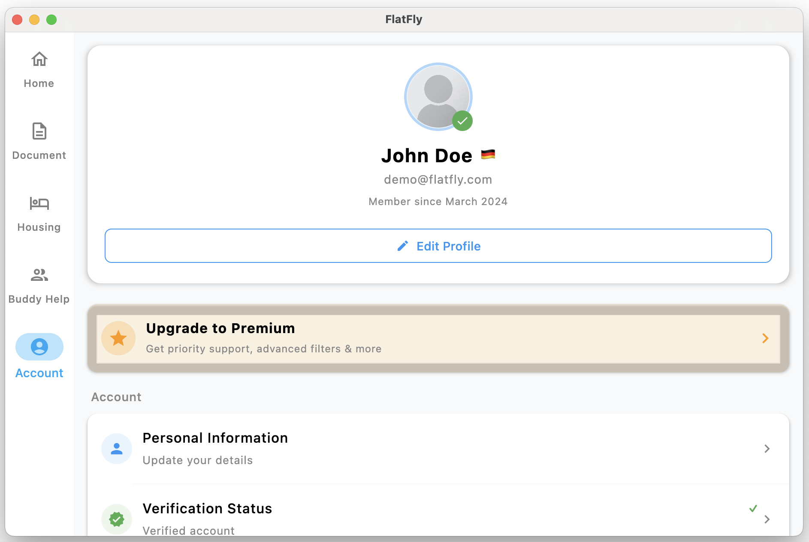

# FlatFly MVP - Technical Documentation

## 📋 Table of Contents

- [Overview](#overview)
- [Platform Support](#platform-support)
- [Screenshots](#screenshots)
- [Development Team](#screenshots)

## 🔍 Overview

FlatFly is a cross-platform application built with Kotlin Multiplatform (KMP) that provides housing solutions for international students in Ingolstadt, Germany. The application integrates AI-powered assistance, document management, and real-time communication features.

### Technical Stack
Frontend: Kotlin Multiplatform + Compose Multiplatform  
Backend: Ktor Server + PostgreSQL  
AI Integration: OpenAI GPT-4 API  
Analytics: Mixpanel SDK  
Deployment: Docker + GitHub Actions  
Cloud: AWS/Azure (Production)  

## 📱 Platform Support

| Platform | Version | Status | Download |
|----------|---------|--------|----------|
| Android | 7.0+ (API 24+) | ✅ Stable | [APK](https://github.com/fauzisho/Flatfly/releases/download/v0.0.3/composeApp-debug.apk) |
| iOS | 13.0+ | ✅ Stable | Available by request |
| Windows | 10+ | ✅ Stable | [MSI](https://github.com/fauzisho/Flatfly/releases/download/v0.0.3/FlatFly-1.0.0.msi) |
| macOS | 10.15+ | ✅ Stable | [DMG](https://github.com/fauzisho/Flatfly/releases/download/v0.0.3/FlatFly-1.0.0.dmg) |
| Web | Modern browsers | ✅ Stable | [Live Demo](https://fauzisho.github.io/Flatfly) |
## 📸 Screenshots

### Mobile Applications

#### Android Interface  
<table>
  <tr>
    <td><strong>Android Home Screen</strong></td>
    <td><strong>Android Chat Interface</strong></td>
  </tr>
  <tr>
    <td> Main dashboard showing available apartments and quick actions</td>
    <td> AI-powered chat assistant for housing inquiries</td>
  </tr>
  <tr>
    <td><strong>Apartment Details</strong></td>
    <td></td>
  </tr>
  <tr>
    <td> Detailed apartment view with 360° photos and booking options</td>
    <td></td>
  </tr>
</table>

### Desktop Applications

#### macOS Application  
<table>
  <tr>
    <td><strong>macOS Interface</strong></td>
    <td><strong>macOS Settings</strong></td>
  </tr>
  <tr>
    <td> Native macOS design with Touch Bar support</td>
    <td> Comprehensive settings panel with dark mode support</td>
  </tr>
</table>

### Web Application  
<table>
  <tr>
    <td><strong>Web Dashboard</strong></td>
    <td><strong>Web Mobile View</strong></td>
  </tr>
  <tr>
    <td> Responsive web interface accessible from any browser</td>
    <td> Mobile-optimized web experience</td>
  </tr>
</table>

## Development Team

Kristina Schurr - Bussiness (Hustler)  
Fauzi Sholichin - Developer (Hacker)  
Ferihan Özyigit - Designer (Hipster)  

Built with ❤️ for international students
